In 1952 at the end of The Spirit's original run as a newspaper insert, Will Eisner was losing interest in the strip. Television among other things was cutting into the viability of maintaining the strip and Eisner wanted to put his talents elsewhere. Already the strip was being written by Jules Feiffer, so a proper replacement artist needed to be found.

One trend at the time was outer space antics and flying sauces and whatnot. So Eisner took the adventures of Denny Colt into an unusual venue, specifically the Moon. The Spirit is recruited to oversee some prisoners who have themselves been recruited to accompany one Professor Skol in his rocket ship.

Now who is arguably the finest space opera artist in comics? Wally Wood of course and that's who Eisner tapped to take over the strip during this offbeat new trend in the series. The experiment failed and eventually the Spirit was canceled before the end of the storyline, but some very engaging artwork was created by Wood and Eisner during this period.

Kitchen Sink collected these stories along with the scripts by Jules Feiffer for the unfinished material back in 1989 in one of the most handsome comic volumes I happen to own.

Here's a link to some of the earliest stories in the sequence. And here's a link to another one.

Here are the very dramatic splash pages to the original Spirit stories. In the third story " A DP on the Moon", the dictator was originally written by Jules Feiffer to be Hitler. Wally Wood apparently drew it that way, but Eisner changed it to a fictional South American dictator. He thought there were too many Hitler-is-still-alive stories at the time. It's too bad as that really undermines the effectiveness of the story.

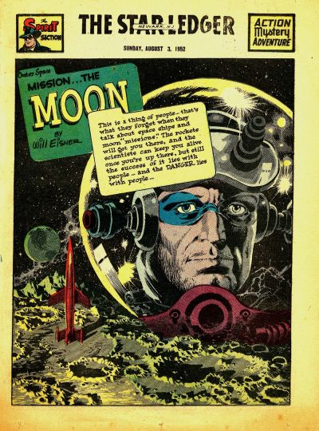

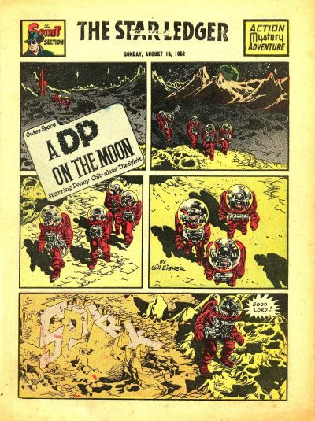

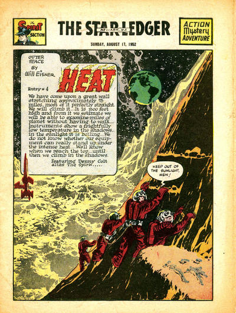

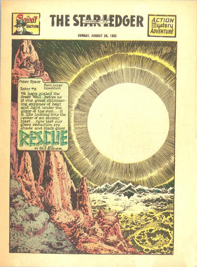

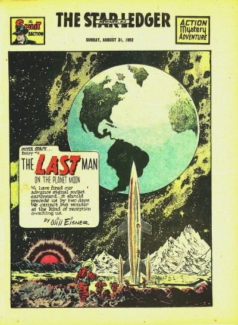

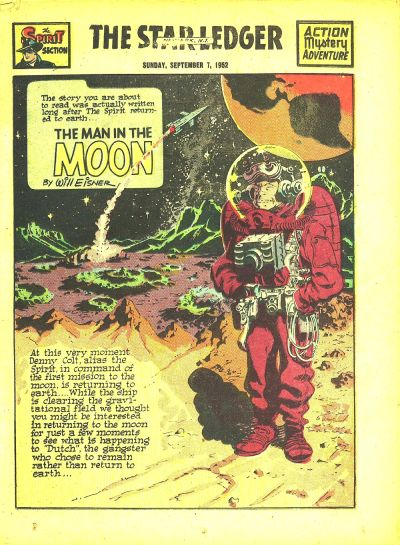

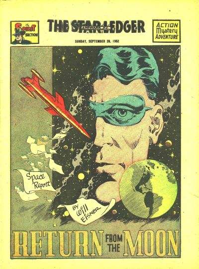

And here are a trio of covers done by Will Eisner for regular Kitchen Sink comic reprints of these stories.

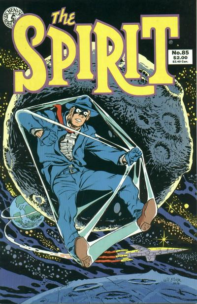

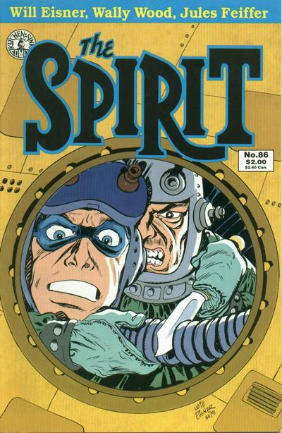

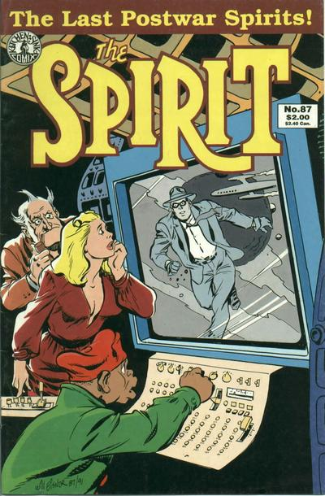

And here's the DC Archive featuring these final stories.

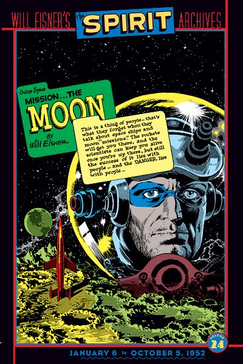
